# README

这个仓库提供了支付宝 2015年新年红包时间，并设置了提前 5分钟提醒。

你只需要订阅这个日历，就可以在收到提醒时，开心的抢红包了。

祝大家新年快乐。

## 订阅日历地址

```
http://hotoo.me/hongbao/2015/alipay.ics
```

可以使用手机支付宝扫描下面的二维码，拷贝上面提供的 URL 地址。


## 订阅方法

### Google 日历

1. 浏览器中打开 Google 日历。
1. 在左侧的 其他日历(Other calendars) 中，点击三角下拉菜单中选择 `Add by URL` 菜单项。

  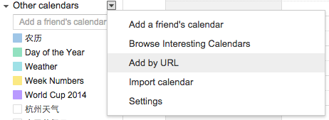

1. 弹出的 Add by URL 对话框中，URL 填入 `http://hotoo.me/hongbao/2015/alipay.ics`

  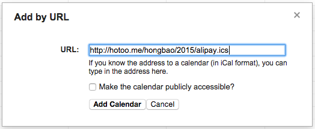

1. 其他不用选，点击 `Add Calendar` 即可。

### iPhone 手机

1. 找到 `设置` 并点击启动。
1. 进入设置

  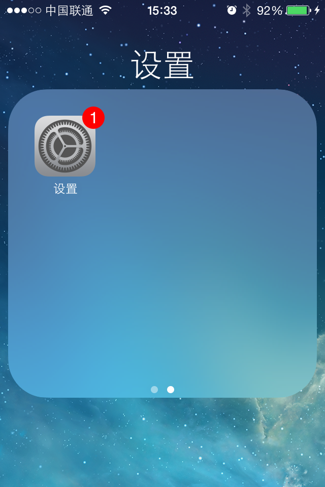

1. 点击 `邮件、通讯录、日历`

  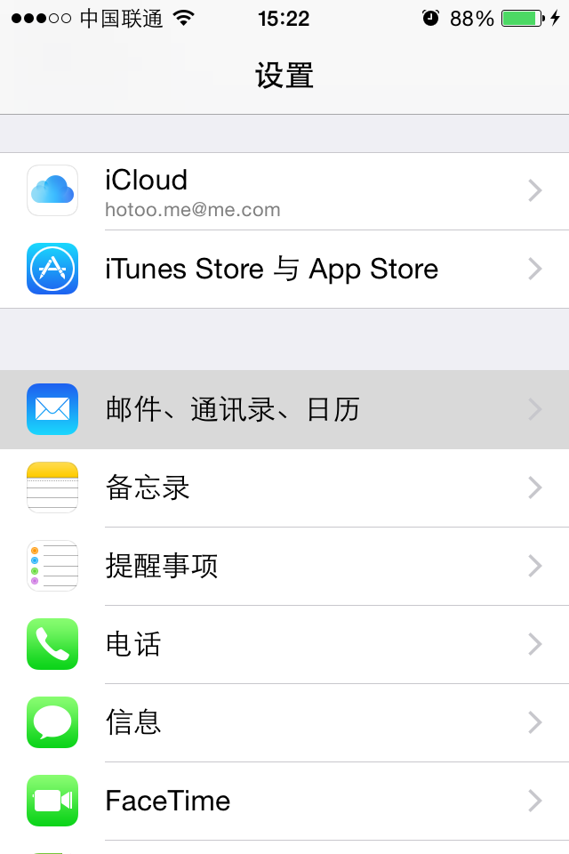

1. 点击 `添加账户`

  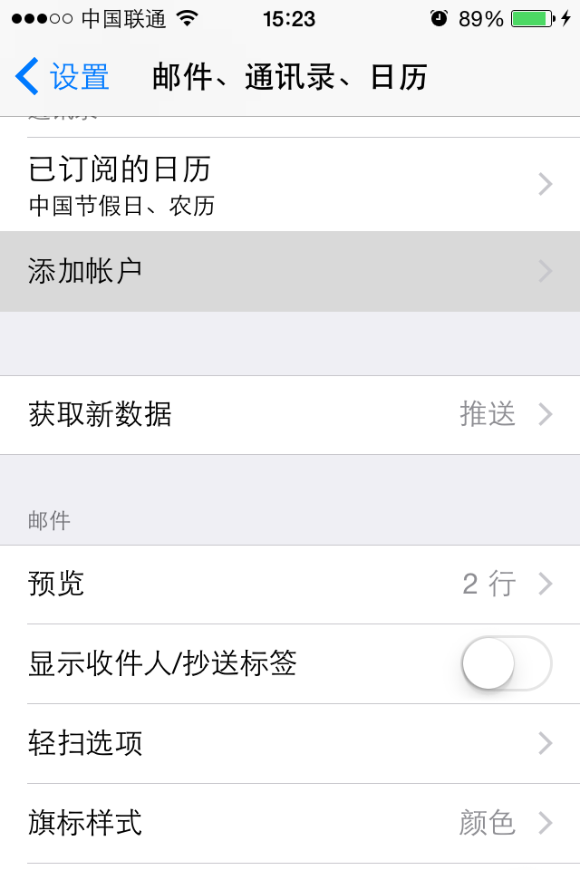

1. 点击 `其他`

  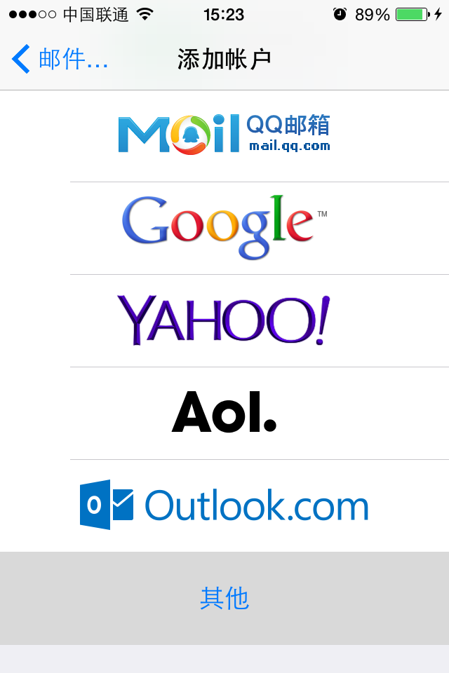

1. 点击 `添加已订阅的日历`

  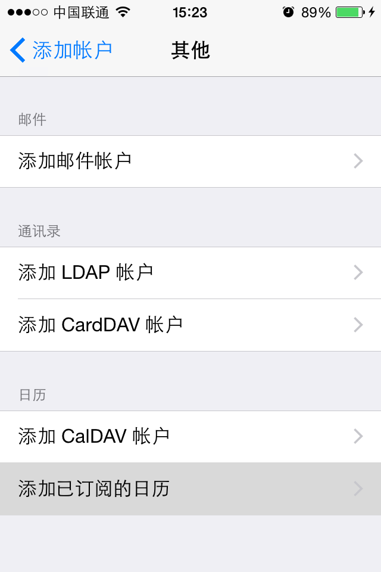

1. `服务器` 中填入 `http://hotoo.me/hongbao/2015/alipay.ics` 点击 `下一步`

  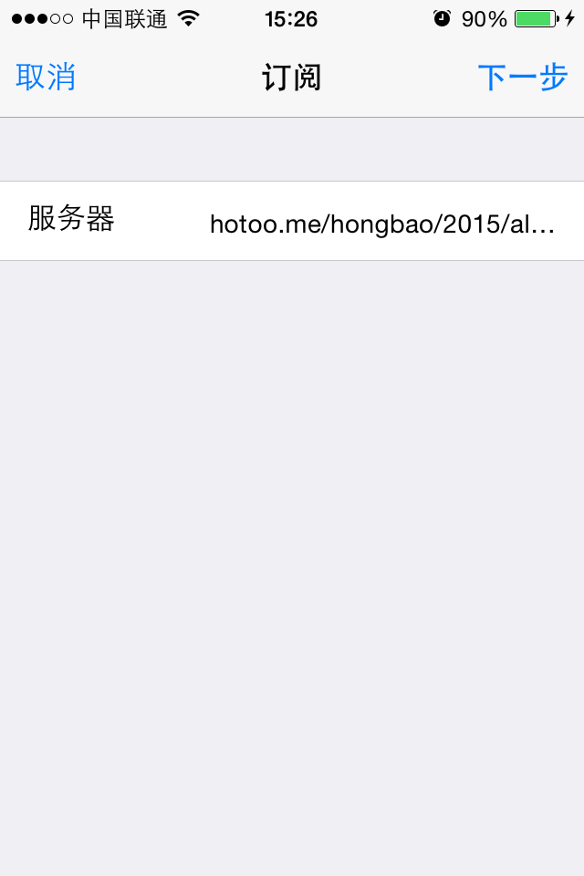

1. 点击 `存储`

  **注意不要选中 `移除提醒`，和截图中的状态一样即可。**

  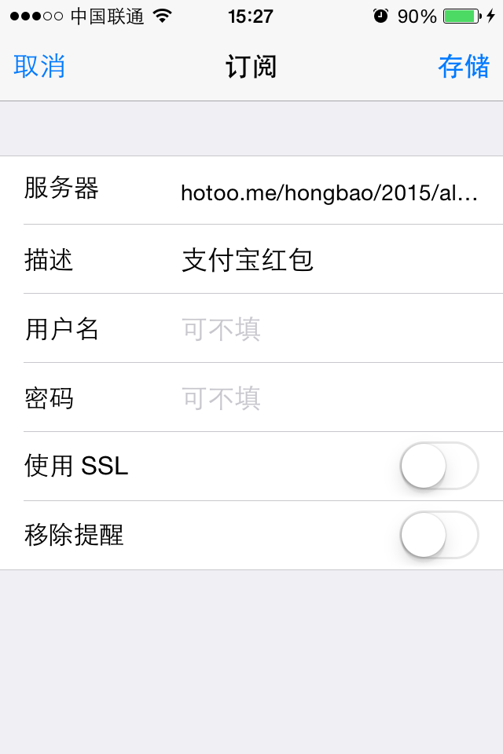

### Mac iCal

1. 打开 iCal 软件
1. 选择 `文件` 菜单中的 `新建日历订阅...`

  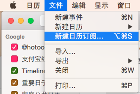

1. `日历 URL` 中填入 `http://hotoo.me/hongbao/2015/alipay.ics`

  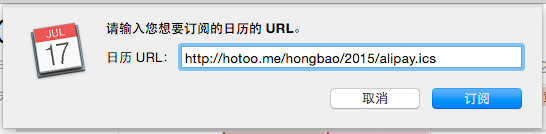

1. 注意取消 `移除：提醒` 复选框的选中状态，和截图中一样。

  另外为了能更及时的得到更新，建议选择 `每小时` 自动更新。

  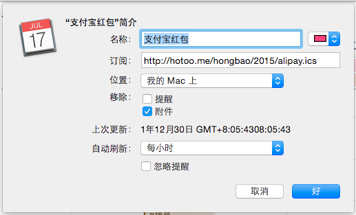

1. 点击 `好`，就好了。
