> **不论您多大了，您还在抢 5毛8分钱的红包吗？**
>
> **说实话，即使是要饭的，平日里都没脸收这点钱。**
> 
> **您还把这当『新年红包』给收了。**
>
> **混成这样，我对您佩服的真是五体投地哇！**

# 2015年新春红包

这个仓库提供了手机支付宝、微信、手机QQ 在 2015年新年派发红包的时间，并设置了提前 5分钟提醒。

你只需要订阅这个日历，就可以在收到提醒时，开心的抢红包了。

祝大家新年快乐。

## 订阅日历地址

```
http://hotoo.me/hongbao/2015/hongbao.ics
```

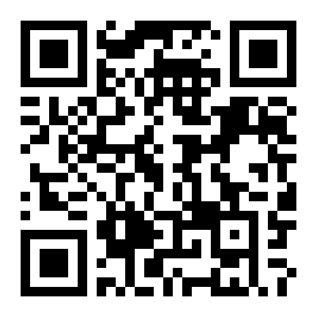

或

```
https://www.google.com/calendar/ical/umf5j0kge0rks5kermj2a1u6ts%40group.calendar.google.com/public/basic.ics
```

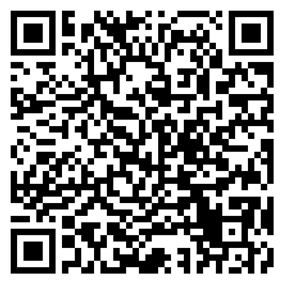

可以使用手机支付宝扫描各自下面的二维码，拷贝上面提供的 URL 地址。

## 预览

https://www.google.com/calendar/embed?src=umf5j0kge0rks5kermj2a1u6ts%40group.calendar.google.com&ctz=Asia/Shanghai

## 如何抢红包？

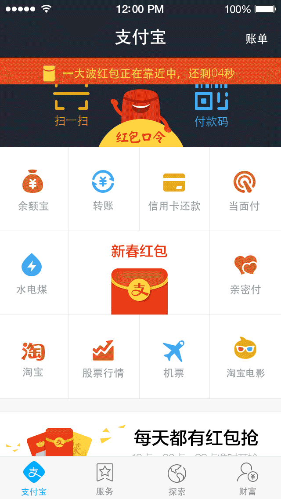

## 订阅方法

### Google 日历

1. 浏览器中打开 Google 日历。
1. 在左侧的 其他日历(Other calendars) 中，点击三角下拉菜单中选择 `Add by URL` 菜单项。

  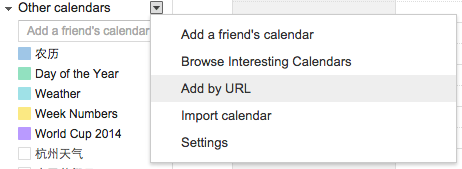

1. 弹出的 Add by URL 对话框中，URL 填入 `https://www.google.com/calendar/ical/umf5j0kge0rks5kermj2a1u6ts%40group.calendar.google.com/public/basic.ics`

  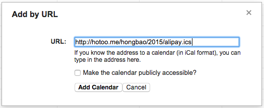

1. 其他不用选，点击 `Add Calendar` 即可。

### iPhone 手机

1. 找到 `设置` 并点击启动。
1. 进入设置

  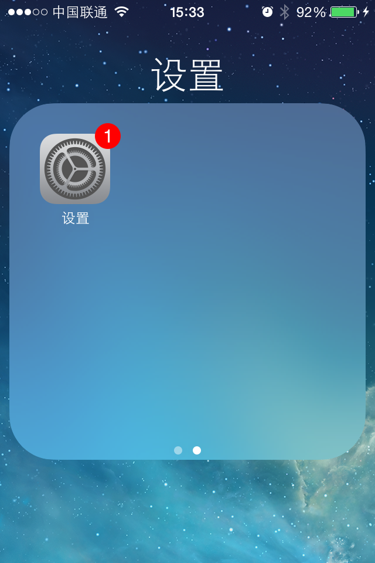

1. 点击 `邮件、通讯录、日历`

  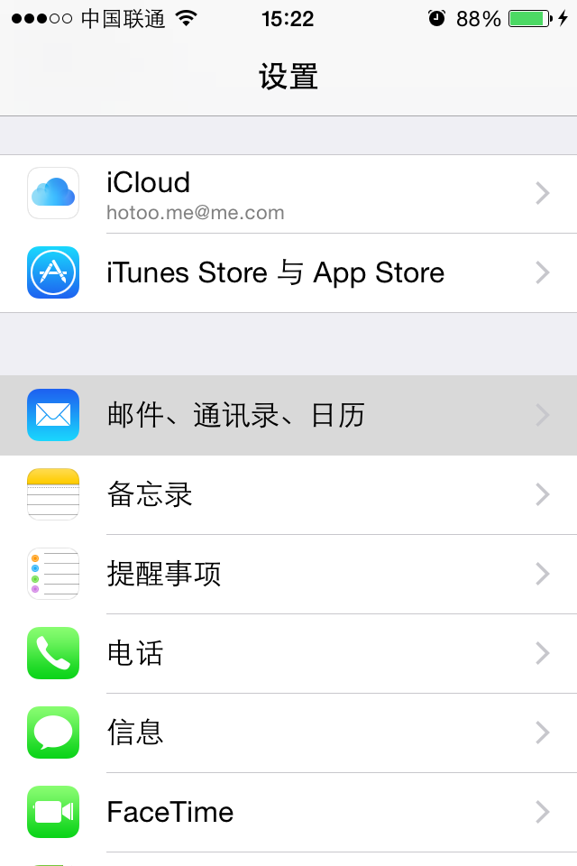

1. 点击 `添加账户`

  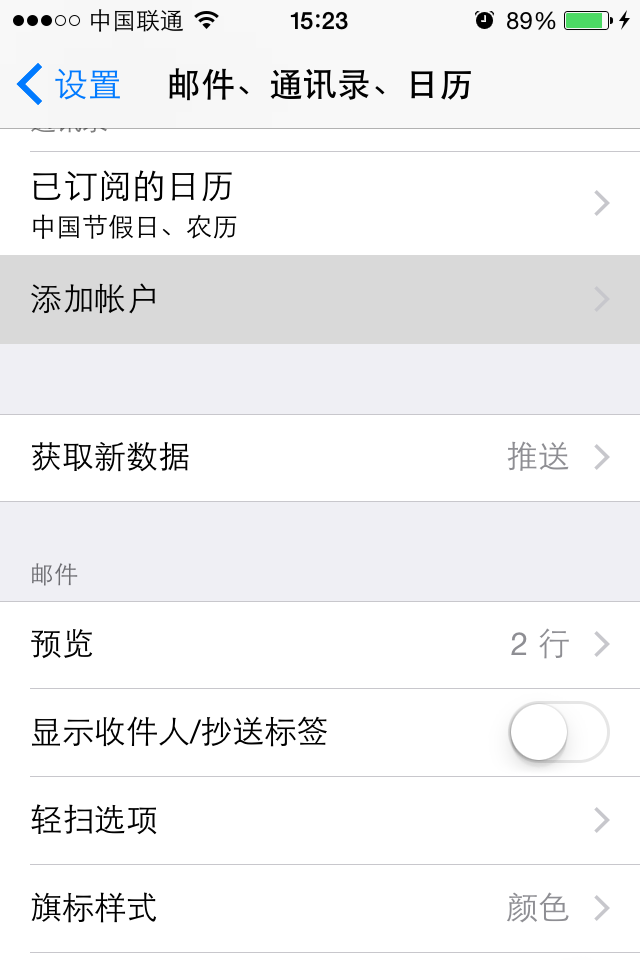

1. 点击 `其他`

  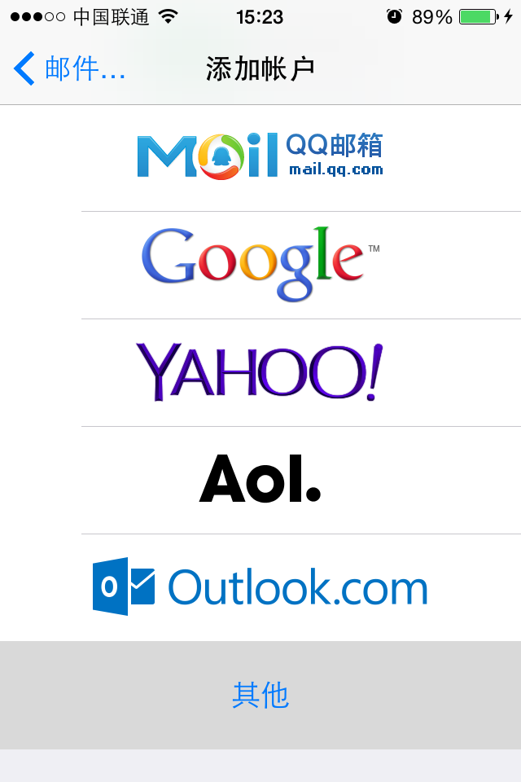

1. 点击 `添加已订阅的日历`

  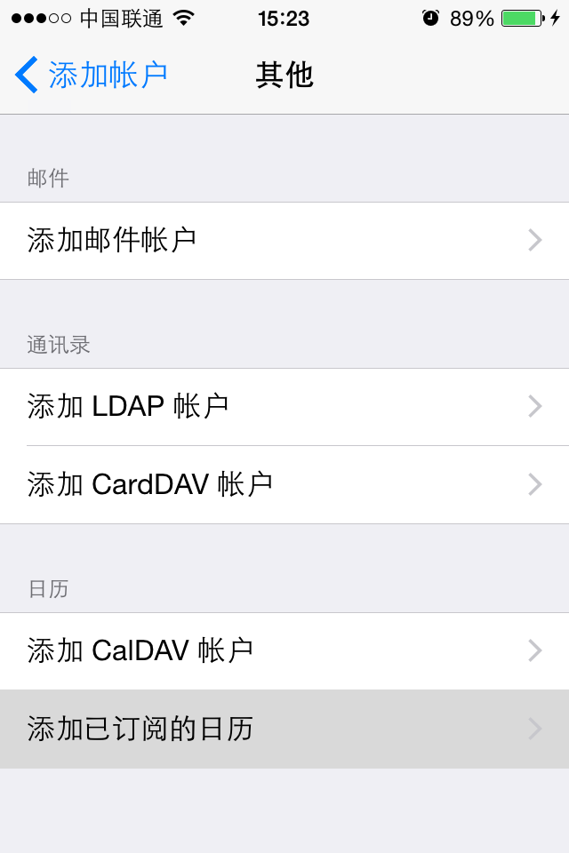

1. `服务器` 中填入 `http://hotoo.me/hongbao/2015/hongbao.ics` 点击 `下一步`

  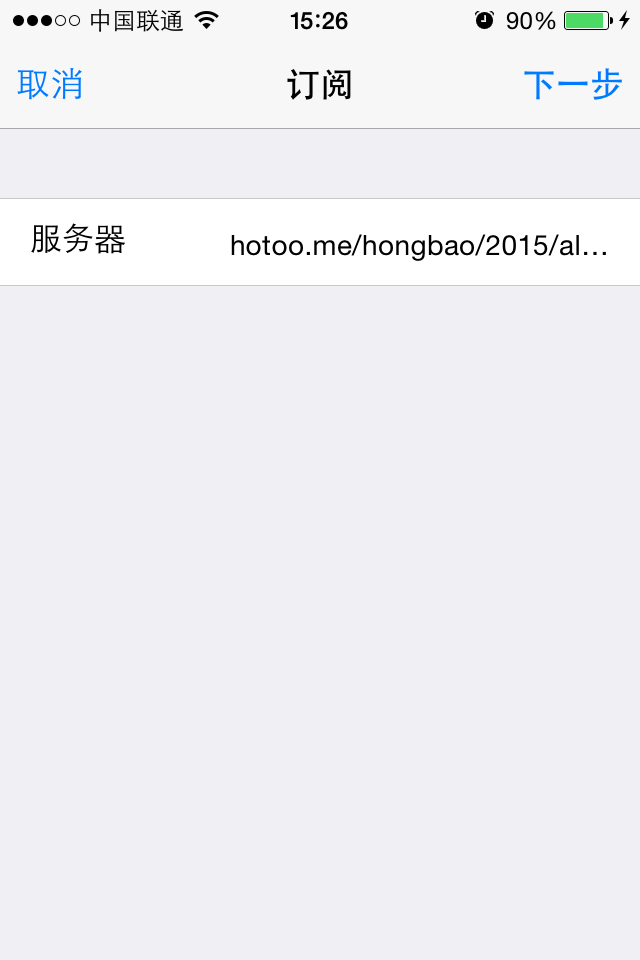

1. 点击 `存储`

  **注意不要选中 `移除提醒`，和截图中的状态一样即可。**

  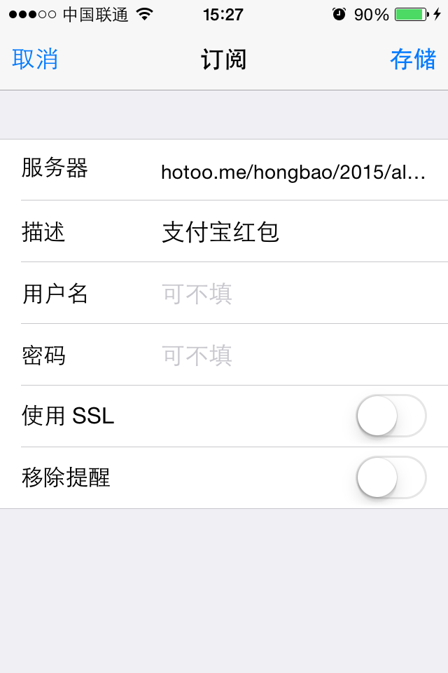

### Mac iCal

1. 打开 iCal 软件
1. 选择 `文件` 菜单中的 `新建日历订阅...`

  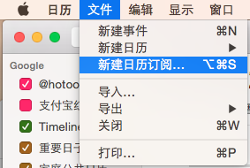

1. `日历 URL` 中填入 `http://hotoo.me/hongbao/2015/hongbao.ics`

  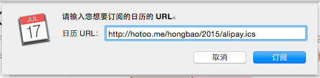

1. 注意取消 `移除：提醒` 复选框的选中状态，和截图中一样。

  另外为了能更及时的得到更新，建议选择 `每小时` 自动更新。

  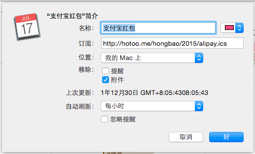

1. 点击 `好`，就好了。

### 其他手机？

我没有其他手机，如果你有，不妨提供下 [订阅过程的截屏](https://github.com/hotoo/hongbao/issues)，谢谢 ：）
